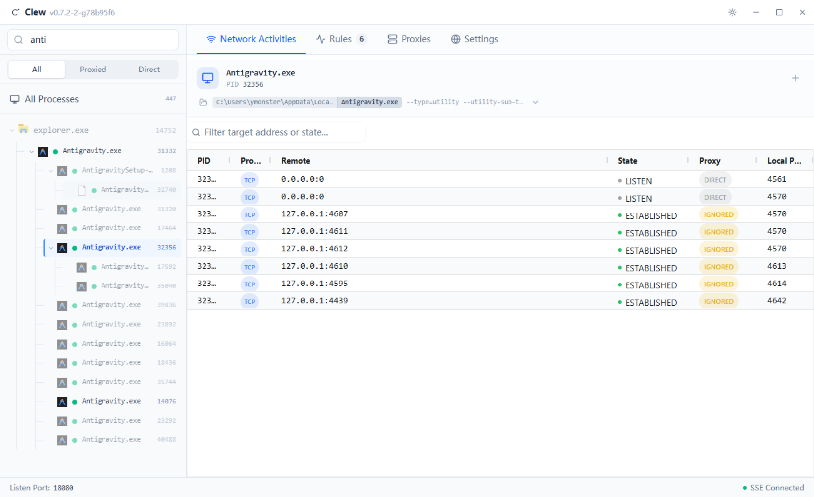
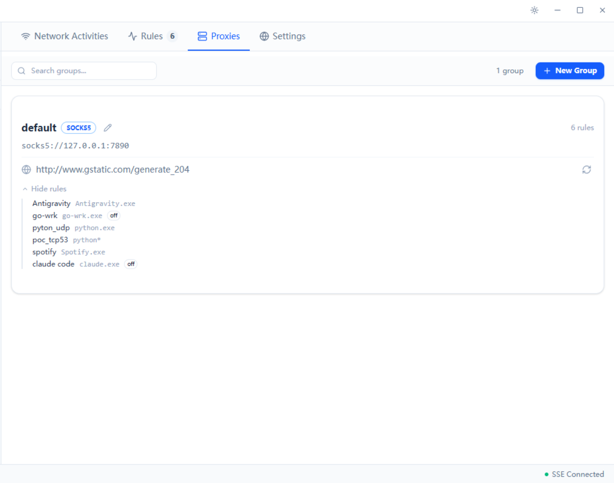
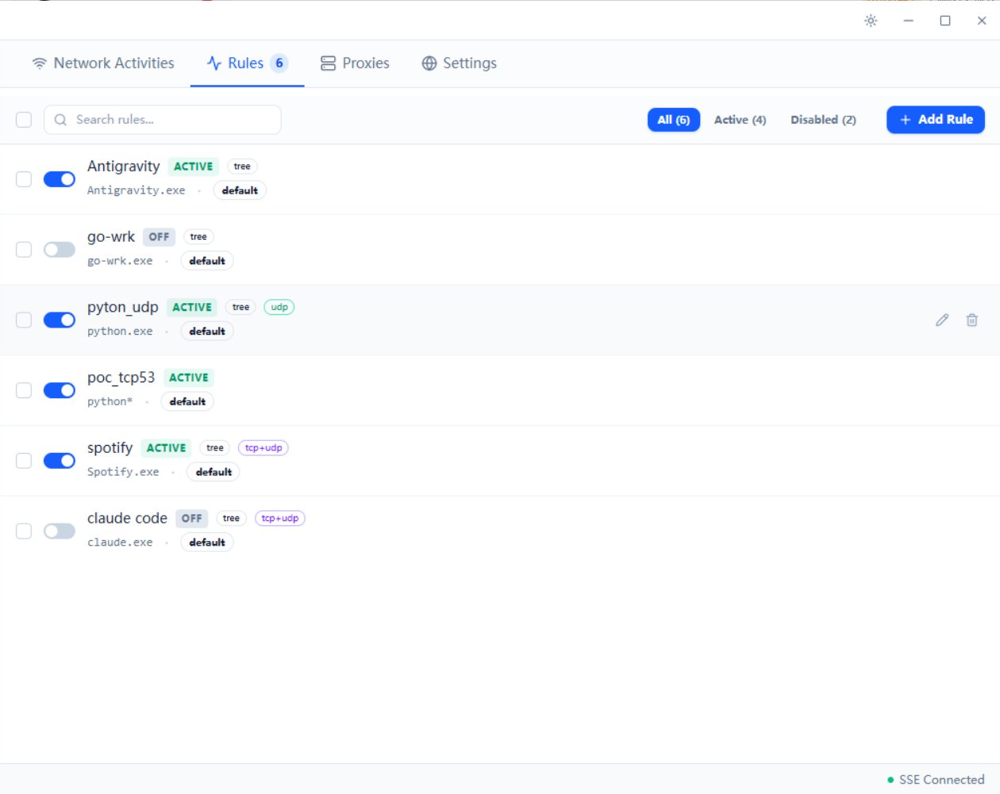
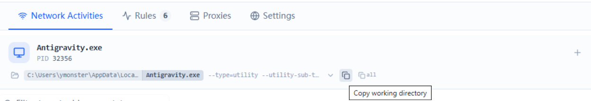

# Clew

> Windows process-level traffic proxy

**Languages**: [简体中文](README.md) · [English](README.en.md)

[](https://github.com/ymonster/clew-proxy/releases)
[](LICENSE)



---

## Overview

A process-level traffic proxy for Windows.

The reason I built it: long ago while using Antigravity I hit a wall — with my Clash backend, TUN mode off meant I couldn't even refresh the model list, and turning TUN on broke other apps. I didn't want to hijack all traffic globally just for one app, so I built a tool that lets specific processes go through the proxy on their own. It has evolved into what it is today.

## Features

- **Process-tree proxying**: once a rule matches, all child processes (including ones dynamically spawned later) are proxied together. Chromium / Electron apps fork a lot of child processes — proxying just the main one usually isn't enough, or you'd have to dig around to figure out which child actually does the network work. Now you can go to the `Rules` page, pick a specific image path, or just type a name (e.g. `Antigravity.exe`) — either way works.
- **Command-line matching**: for cases like the same `python.exe` running different scripts, you can match by command-line keywords on the `Rules` page (e.g. proxy only the process running `crawler.py`, leave other python processes alone).
- **Multiple SOCKS5 backends**: configure several proxy groups and route different rules to different groups. Most proxy clients I use already speak SOCKS5, and HTTP proxying is usually handled by those clients themselves — so I didn't need to build HTTP support in.
- **UDP support**: per-app-port SOCKS5 UDP ASSOCIATE, per RFC 1928.
- **Built-in DNS forwarder**: when enabled, the system DNS is pointed at Clew's built-in forwarder; queries go through SOCKS5 to upstream. On disable or exit, the system DNS is restored. If the process is force-killed, the next launch detects the leftover state and restores it.

## Is this tool for me

**Good fit**

- You want a specific app to go through a proxy, but it may not be HTTP-only — it could also do arbitrary TCP / UDP, and you don't know (or don't want to care) which child process actually does the network work.
- You already have a proxy client (Clash-style) running, and only want a few specific apps to route through it — you don't want global TUN.
- You care about MIT licensing, e.g. integrating into internal tooling or a commercial product without catching AGPL.

**Not a fit**

- You need macOS / Linux → try [ProxyBridge](https://github.com/InterceptSuite/ProxyBridge)
- You want a CLI-only tool, no GUI → try [ProxiFyre](https://github.com/wiresock/proxifyre)

## Install & Run

### Requirements

- Windows 10 version 2004 or newer / Windows 11
- Administrator privileges (required by both WinDivert driver and system DNS configuration)
- [VS2022 C++ Redistributable](https://aka.ms/vs/17/release/vc_redist.x64.exe)
- WebView2 Runtime (bundled on Windows 11; download from [Microsoft](https://developer.microsoft.com/microsoft-edge/webview2/) on Windows 10)

### Download

Grab the latest zip from the [Releases page](https://github.com/ymonster/clew-proxy/releases), extract, double-click `clew.exe` — it will auto-trigger UAC.

## Usage

### 1. Configure a proxy backend

Proxies tab:

- A `default` group already exists — change its host / port to point at your SOCKS5 (e.g. Clash at `127.0.0.1:7890`).
- The refresh icon runs a latency test.



### 2. Add an Auto Rule

Rules tab:

- Click `Add Rule` to create a new rule. New rules default to OFF — flip the toggle to activate.
  - **Name**: rule name
  - **Process name**: glob wildcards, e.g. `curl*`, `python.exe`
  - **Cmdline pattern**: command-line keywords (space-separated, case-insensitive, order-independent)
  - **Hack tree**: check = child processes are proxied too
  - **Protocol**: TCP / UDP / Both
  - **Proxy group**: which proxy group to route through
- You can review the rule list and its current state here.



### 3. Process Tree and Network Activities

- **Process Tree**: the left sidebar process tree. Hovering a process reveals a small lightning icon on the right; clicking it proxies the current PID (plus any future children). Useful for ad-hoc debugging. **A manual hijack always proxies both TCP and UDP — the protocol is not selectable**; if you want one or the other, use the `Protocol` field on an Auto Rule.

  

- **All Processes**: click `All Processes` on the left (or deselect any specific process) to see the live network activity across all processes.
- **Network Activities header**: once a process is selected, a detail bar appears at the top.
  - **Locate**: the explorer icon to the left of the name reveals the executable's directory.
  - **Copy info**: hovering over the path bar shows two copy icons — the left one copies the working directory, the right `all` icon copies the full command line including the image path.
  - **Create a rule from this process**: the `+` icon on the right uses the current process as a template for a new rule.

  

### 4. DNS Proxy (disabled by default)

Some apps (Spotify, certain geo-sensitive services) are picky about DNS resolution. With Settings → DNS Proxy on:

- The system DNS is auto-configured to `127.0.0.2` (Clew's built-in forwarder).
- DNS queries go through SOCKS5 to the upstream resolver (default `8.8.8.8`).
- On disable / exit the system DNS is auto-restored; if the process is force-killed, the next launch detects leftover state and restores it.

## Technical choices

### Third-party libraries

Backend:

- [WinDivert](https://github.com/basil00/Divert) — Windows user-mode WFP packet capture / forwarding library; dynamically linked, shipped with the release (LGPL v3)
- [quill](https://github.com/odygrd/quill) — async structured logging
- [nlohmann/json](https://github.com/nlohmann/json) — JSON parsing and serialization
- [cpp-httplib](https://github.com/yhirose/cpp-httplib) — HTTP + SSE server
- [asio](https://think-async.com/Asio/) — asynchronous I/O
- [WebView2](https://developer.microsoft.com/microsoft-edge/webview2/) — embedded Edge for the frontend UI

Frontend:

- [Vue 3](https://vuejs.org/) + TypeScript + [Vite](https://vitejs.dev/) — app framework and build
- [reka-ui](https://reka-ui.com/) (shadcn-vue style) + [Tailwind CSS](https://tailwindcss.com/) — components and styling
- [AG Grid Community](https://www.ag-grid.com/) — Network Activities table
- [Monaco Editor](https://microsoft.github.io/monaco-editor/) — JSON editor inside Settings (lazy-loaded)
- [Lucide](https://lucide.dev/) — icons

Full license information: see [THIRD_PARTY_NOTICES.md](THIRD_PARTY_NOTICES.md).

### Why WinDivert

- Mature WFP callout driver with solid Win10/11 support
- LGPL v3 permits dynamic linking of the `.dll`, so the main project stays MIT
- **Free**: the WinDivert author already paid for kernel-driver signing — what gets released is already signed `.sys`

### Why not DLL injection (for now)

1. I tried injecting `GetAddrInfoW` — it worked fine, but many modern processes use their own async DNS resolvers and bypass it. So we'd need to inject `getaddrinfo` / `GetAddrInfoW` / `connect` / `WSAConnect` / `ConnectEx` and friends simultaneously — a bigger engineering commitment.
2. Combining with `PsSetCreateProcessNotifyRoutineEx` would give us more accurate process creation / destruction events and cleaner interception at the network layer.
3. These worked on my machine, but in the real world you also have to deal with AV / EDR, signing via SignPath-type services, and adapting to various security products — which takes a long time and may cost money.
4. Conclusion: WinDivert is enough for now. If there's real demand, I'll open a branch and try DLL injection.

### Why not a self-built WFP kernel driver

Technically cleaner (`FWPM_LAYER_ALE_CONNECT_REDIRECT_V4` rewrites the socket destination directly — zero packet manipulation), but the fatal issue: Windows 10+ requires kernel drivers to be signed by Microsoft, via Partner Center, which needs an EV code-signing certificate (~300–600 USD / year) and an attestation flow. SignPath-style OSS signing services only cover user-mode Authenticode — they don't do kernel drivers. The cost isn't worth it for a personal open-source project right now.

## Build

### Toolchain

- Visual Studio 2022 (C++23)
- CMake 3.20+
- vcpkg
- Node.js 20+
- WebView2 SDK

### Steps

```bash
# Configure
cmake --preset windows-vcpkg

# Backend (post-refactor the source tree has ~30 TUs, up from 2 in the legacy
# header-only layout — first clean build takes noticeably longer than before;
# CMakeLists already enables /MP, which gives a sizeable speedup on multi-core hosts)
cmake --build build --config Release

# Frontend
cd frontend
npm install
npm run build
cd ..

# Run
./build/Release/clew.exe
```

## Contributing

Issues / PRs welcome. Project structure, architecture, and API schema are documented in [docs/ARCHITECTURE.md](docs/ARCHITECTURE.md).

## License

- Clew: [MIT](LICENSE)
- Dynamically linked [WinDivert](https://github.com/basil00/Divert): LGPL v3 (original license preserved at `WinDivert-2.2.2-A/LICENSE`)
- Other third-party licenses: see [THIRD_PARTY_NOTICES.md](THIRD_PARTY_NOTICES.md)
