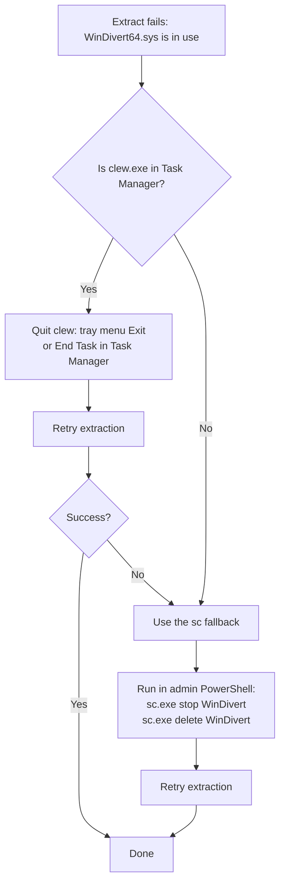

# Troubleshooting

> **Languages**: [简体中文](TROUBLESHOOTING.md) · [English](TROUBLESHOOTING.en.md)

Ordered by how often users actually hit the issue, most common first.

---

## 1. Double-clicking does nothing / no UAC prompt appears

**Symptom**: A black window flashes and disappears, or nothing happens at all.

**Causes** (in order of likelihood):

1. **Not logged in as administrator**: Clew can't elevate via RunAs; the current Windows account itself needs admin privileges. Run `whoami /groups | findstr "S-1-5-32-544"` in a terminal to confirm.
2. **WebView2 Runtime not installed**: built into Windows 11 and recent Windows 10; download the [Evergreen Standalone Installer from Microsoft](https://developer.microsoft.com/microsoft-edge/webview2/) on stripped-down or offline systems.
3. **UAC disabled by group policy**: check `Control Panel → User Accounts → Change User Account Control settings` — don't set it to "Never notify". Especially relevant on domain-joined machines.

**To diagnose**: right-click `clew.exe` → "Run as administrator". If it still flashes and dies, open `Event Viewer → Windows Logs → Application` and look at the latest Application Error entry — it'll show the crashing module.

## 2. UI starts but proxy is not working

**Symptom**: UI is up, you've added a rule, but the target app's traffic still goes direct.

**Walk through these checks in order**:

1. **Is the rule toggle ON?** New rules default to OFF — you need to flip the switch on. The Rules page shows the state.
2. **Does the SOCKS5 backend actually work?** Each proxy group has a latency-test button (the small refresh-style icon). Use it to verify the backend is reachable.
3. **Process matched but traffic doesn't go through proxy**:
   - Check the `Protocol` field on the rule. If it's TCP only, UDP traffic won't be proxied; pick `Both` for full coverage.
   - Is the destination on a local / loopback network? By design `default_exclude_cidrs` excludes 127/8 + 10/8 + 172.16/12 + 192.168/16 + 169.254/16, so traffic to those ranges stays direct (avoids breaking local services). To proxy a specific intranet range, edit `default_exclude_cidrs` to remove that CIDR.

## 3. WinDivert64.sys locked when upgrading

**Symptom**: Extracting a new version's zip fails with "file in use, cannot replace `WinDivert64.sys`".

**Why**: The driver is a kernel-mode service (service name = `WinDivert`). Even if `clew.exe` exits, the service may not stop immediately on certain code paths (abnormal exit, installer race), and the file stays locked.

**Recovery flow**:



**sc commands** (admin PowerShell):

```powershell
sc.exe stop WinDivert
sc.exe delete WinDivert
```

The explicit `.exe` suffix avoids collision with PowerShell's built-in `Set-Content` alias. `delete` does **not** remove the `WinDivert64.sys` file from disk — it only unregisters the service from the SCM. The next `clew.exe` start re-registers it.

## 4. DNS resolution breaks after enabling DNS Proxy

**Symptom**: After turning on Settings → DNS Proxy, browsers and other apps can't resolve any DNS.

**What to do**:

1. **Normal path**: turn off Settings → DNS Proxy. Clew will automatically restore the original system DNS.
2. **Clew crashed before it could restore**: launch Clew again — it detects the leftover `dns_state.json` and restores the original DNS on startup.
3. **Can't get Clew running / never want to use this feature again**: reset DNS manually — `Control Panel → Network and Sharing Center → Change adapter settings → right-click your network adapter → Properties → IPv4 → Obtain DNS automatically`.

**Root cause to fix**: DNS Proxy startup failure is usually because the upstream is unreachable. `Settings → DNS Proxy → upstream` defaults to `8.8.8.8:53`. If your network blocks 8.8.8.8 (common in some regions), change it to `1.1.1.1:53` or your ISP's DNS.

## 5. Reading the log

**Location**: `clew.log` in the same directory as `clew.exe`.

**Verbosity**: Settings → Log Level → `debug` (default is `info`). Takes effect immediately, no restart needed.

**Common errors**:

| Keyword | Meaning | Usual cause |
|---|---|---|
| `WinDivertOpen failed` | Driver couldn't open | Not running as admin; driver not installed properly |
| `socks5 handshake failed` | Can't reach SOCKS5 upstream | Wrong host:port; backend not running; firewall blocking |
| `bind 18080 failed` | API port in use | Another Clew already running, or another program is bound to 18080 |
| `ETW session creation failed` | Process monitoring couldn't start | Not running as admin; rare same-named ETW session conflict |

## 6. Filing an issue

The most useful information to include:

1. Clew version (visible in the bottom-left corner of the UI)
2. Windows version (run `winver`, include the build number if possible)
3. Steps to reproduce — be specific about which button you clicked, which rule you added
4. The last 200 lines of `clew.log` (set log_level to `debug` and reproduce once before grabbing the log)
5. Whether the issue is reliably reproducible

[File an issue on GitHub](https://github.com/ymonster/clew-proxy/issues/new).
