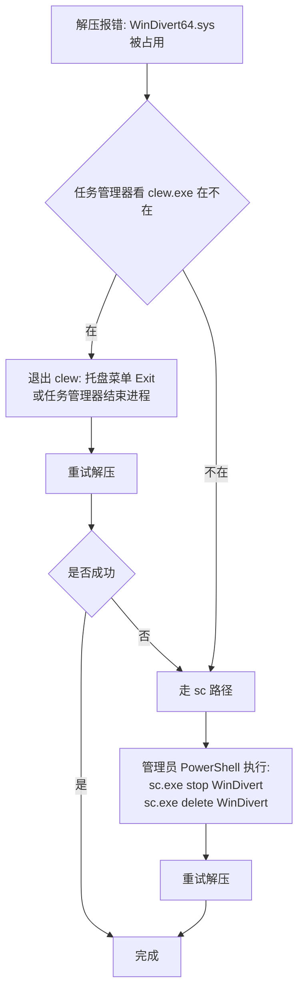

# 常见问题排查

> **Languages**: [简体中文](TROUBLESHOOTING.md) · [English](TROUBLESHOOTING.en.md)

按用户实际遇到的频率排序，最常见的在前。

---

## 1. 双击没反应 / UAC 没弹

**症状**：双击 `clew.exe` 黑框闪一下就没了，或者根本没反应。

**可能的原因**：

1. **当前账户不是管理员**：Clew 不能 RunAs 切换权限，必须当前账户本身有 admin 权限。Win+R 输 `whoami /groups | findstr "S-1-5-32-544"` 确认。
2. **缺少 WebView2 Runtime**：Win10 / Win11 自带，但精简版系统或离线环境可能缺。装 [Evergreen Standalone Installer](https://developer.microsoft.com/microsoft-edge/webview2/) 即可。
3. **UAC 被组策略禁用**：检查本机安全策略或域策略里的 UAC 配置，尤其是管理员批准模式相关策略。

**排查**：右键 `clew.exe` → "以管理员身份运行"，看是否还是闪退。如果还闪退，去 `事件查看器` → `Windows 日志 → 应用程序`，看最近的 Application Error 条目，里面有崩溃模块名。

## 2. UI 起来了但代理不生效

**症状**：UI 正常，加了规则，但目标 app 流量还是直连。

**排查顺序**：

1. **规则开关打开了吗**：新建规则默认是 OFF，要手动打开开关。Rules 页能看到状态。
2. **SOCKS5 后端能用吗**：proxy group 支持延迟测试，那个像刷新的小按钮。
3. **进程命中但流量不走代理**：
   - 检查 `Protocol` 字段——如果设了只 TCP，UDP 流量不会走代理；想全代理就选 Both。
   - 是否在访问内网/loopback。按设计 `default_exclude_cidrs` 排除了 127/8 + 10/8 + 172.16/12 + 192.168/16 + 169.254/16，访问这些范围不会走代理（避免本地服务被代理坏掉）。要让某段内网走代理需手动改这个字段。

## 3. WinDivert64.sys 升级时锁住

**症状**：解压新版本 zip 时报错"文件被占用，无法替换 `WinDivert64.sys`"。

**原因**：driver 是内核服务（service name = `WinDivert`），即使 `clew.exe` 退出，service 在某些路径下不会立刻 stop（崩溃退出 / 安装包替换时序），文件就被锁住。

**处理流程**：



**sc 命令**（管理员 PowerShell）：

```powershell
sc.exe stop WinDivert
sc.exe delete WinDivert
```

`sc.exe` 显式带 `.exe` 是为了避免和 PowerShell 内置的 `Set-Content` 别名冲突。`delete` 不会删 `WinDivert64.sys` 文件，只是把 service 从 SCM 里注销，下次 `clew.exe` 启动会自动重新注册。

## 4. DNS Proxy 开启后 DNS 解析全坏

**症状**：Settings → DNS Proxy 打开后，浏览器 / 其他 app 全部 DNS 解析失败。

**怎么处理**：

1. **正常路径**：把 Settings → DNS Proxy 关掉，Clew 会自动还原系统 DNS。
2. **Clew 崩了来不及还原**：下次启动 Clew，它会检测到 `dns_state.json` 残留并自动还原原来的 DNS。
3. **Clew 装不回来 / 永久不想用了**：手动重置 DNS——`控制面板 → 网络和共享中心 → 更改适配器设置 → 你的网卡右键属性 → IPv4 → 自动获取 DNS`。

**根本原因排查**：DNS Proxy 启动失败一般是上游不通。`Settings → DNS Proxy → upstream` 默认 `8.8.8.8:53`，如果你所在网络访问不到 8.8.8.8（很常见），改成 `1.1.1.1:53` 或者你 ISP 的 DNS。

## 5. 看日志

**位置**：和 `clew.exe` 同目录的 `clew.log`。

**调级别**：Settings → Log Level → 选 `debug`（默认 `info`）。改了立刻生效，不用重启。

**常见报错**：

| 关键词 | 含义 | 通常原因 |
|---|---|---|
| `WinDivertOpen failed` | driver 开不了 | 没用 admin 跑、driver 没装好 |
| `socks5 handshake failed` | 上游 SOCKS5 连不上 | 后端 host:port 错 / 后端没启动 / 防火墙拦 |
| `bind 18080 failed` | API 端口被占 | 已经有一个 Clew 在跑、或别的程序占了 18080 |
| `ETW session creation failed` | 进程监控起不来 | 没用 admin 跑、或者另一个 ETW session 同名冲突（罕见） |

## 6. 想反馈但不知道贴什么

最有用的报告内容：

1. Clew 版本（左下角能看到）
2. 操作系统版本（Win10 / Win11，build 号最好）
3. 操作步骤——具体到点了哪个按钮、加了什么规则
4. `clew.log` 最后 200 行（先把 log_level 改成 debug 再复现一次）
5. 是否能稳定复现

[在 GitHub 提 Issue](https://github.com/ymonster/clew-proxy/issues/new)。
